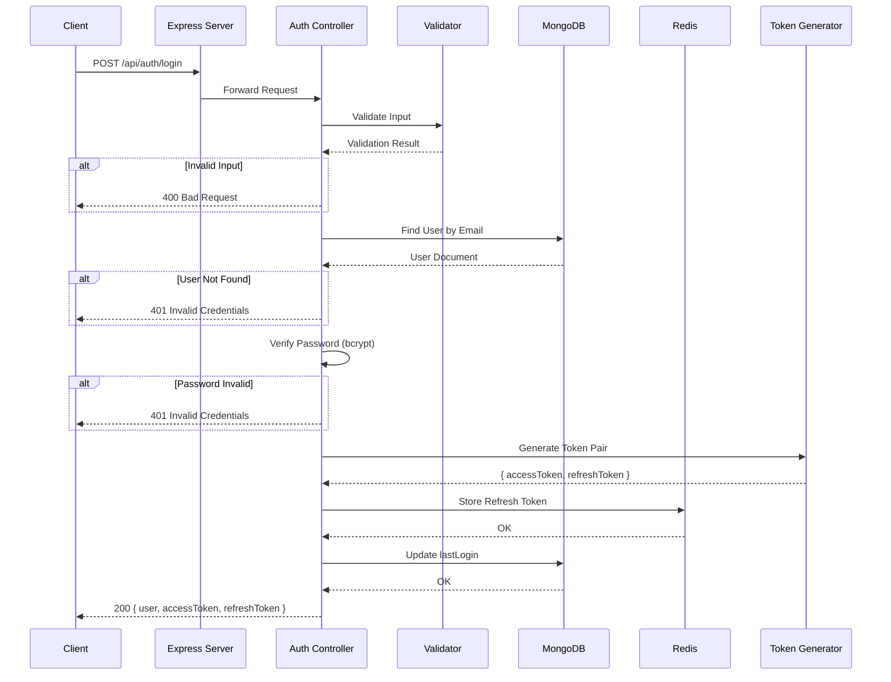
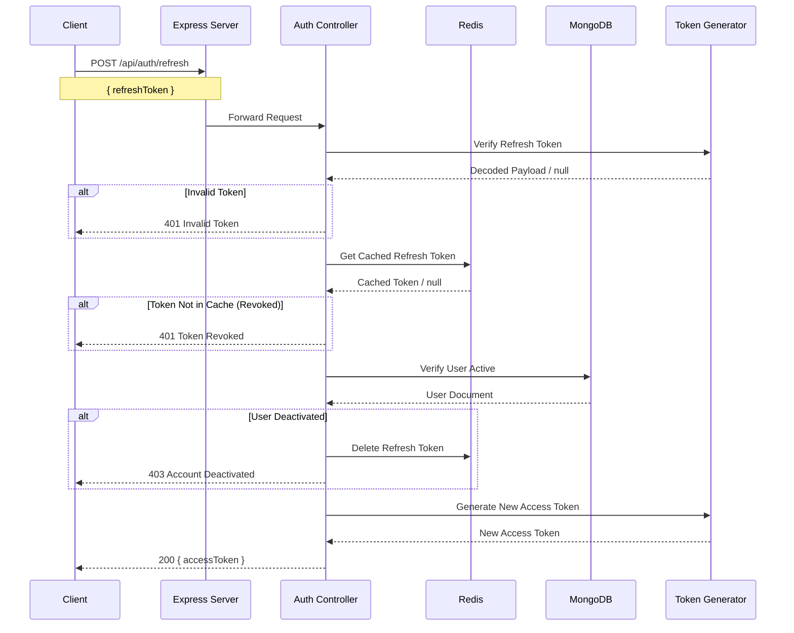
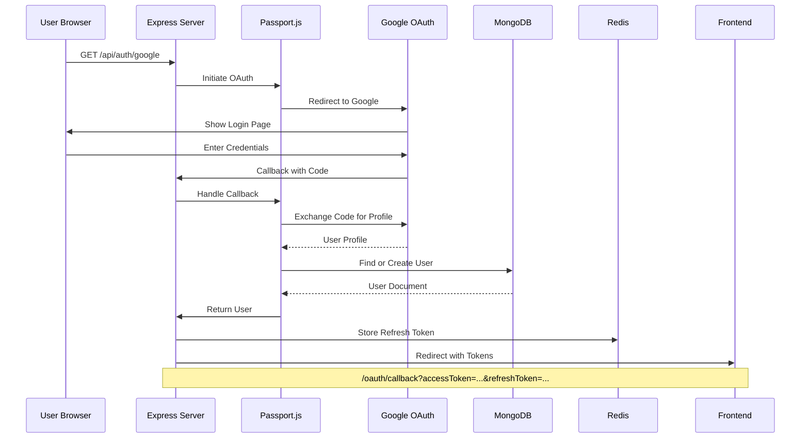

# UCP-TAKRA Backend Architecture

## Overview

UCP-TAKRA is a hackathon/competition management platform with a robust authentication system built on Node.js/Express.js following the MVC pattern.

## System Architecture

```mermaid
graph TB
    subgraph "Client Layer"
        WEB[Web Frontend<br/>React/Next.js]
        MOBILE[Mobile App]
        API_CLIENT[API Clients]
    end

    subgraph "API Gateway"
        EXPRESS[Express.js Server<br/>Port 5000]
    end

    subgraph "Middleware Layer"
        AUTH_MW[Authentication<br/>Middleware]
        ROLE_MW[Role Check<br/>Middleware]
        RATE[Rate Limiting]
        CORS[CORS Handler]
    end

    subgraph "Route Layer"
        AUTH_ROUTES[/api/auth/*]
        USER_ROUTES[/api/users/*]
        FUTURE[Future Routes<br/>/api/competitions/*<br/>/api/hackathons/*]
    end

    subgraph "Controller Layer"
        AUTH_CTRL[Auth Controller]
        USER_CTRL[User Controller]
    end

    subgraph "Service Layer"
        TOKEN_SVC[Token Generator]
        VALIDATE_SVC[Validation Service]
        PASSPORT_SVC[Passport.js<br/>OAuth Service]
    end

    subgraph "Data Layer"
        MONGOOSE[Mongoose ODM]
        REDIS_CLIENT[Redis Client]
    end

    subgraph "External Services"
        GOOGLE[Google OAuth 2.0]
    end

    subgraph "Database Layer"
        MONGO[(MongoDB<br/>Port 27018)]
        REDIS[(Redis Cache<br/>Port 6380)]
    end

    WEB --> EXPRESS
    MOBILE --> EXPRESS
    API_CLIENT --> EXPRESS

    EXPRESS --> CORS
    CORS --> RATE
    RATE --> AUTH_MW
    AUTH_MW --> ROLE_MW

    ROLE_MW --> AUTH_ROUTES
    ROLE_MW --> USER_ROUTES
    ROLE_MW --> FUTURE

    AUTH_ROUTES --> AUTH_CTRL
    USER_ROUTES --> USER_CTRL

    AUTH_CTRL --> TOKEN_SVC
    AUTH_CTRL --> VALIDATE_SVC
    AUTH_CTRL --> PASSPORT_SVC
    AUTH_CTRL --> MONGOOSE
    AUTH_CTRL --> REDIS_CLIENT

    USER_CTRL --> MONGOOSE
    USER_CTRL --> REDIS_CLIENT

    PASSPORT_SVC --> GOOGLE
    MONGOOSE --> MONGO
    REDIS_CLIENT --> REDIS
```

## Authentication Flow

### JWT Token Flow (Login/Signup)



### Token Refresh Flow



### Google OAuth Flow



## Folder Structure

```
backend/
├── config/
│   ├── database.js      # MongoDB connection & cache access
│   ├── cache.js         # Redis connection & caching utilities
│   └── passport.js      # Google OAuth strategy configuration
│
├── controllers/
│   ├── authController.js  # Auth business logic (signup, login, OAuth)
│   └── userController.js  # User management logic
│
├── middleware/
│   ├── auth.js           # JWT verification middleware
│   └── roleCheck.js      # Role-based access control
│
├── models/
│   └── UserSchema.js     # Mongoose user schema with OAuth support
│
├── routes/
│   ├── index.js          # Route aggregator
│   ├── authRoutes.js     # Authentication endpoints
│   └── userRoutes.js     # User management endpoints
│
├── utils/
│   ├── tokenGenerator.js # JWT token creation & verification
│   └── validation.js     # Input validation utilities
│
├── docs/
│   └── ARCHITECTURE.md   # This file
│
├── app.js               # Express app configuration
├── server.js            # Server entry point
├── api.http             # API testing file
├── docker-compose.yml   # Docker container orchestration
├── Dockerfile           # Container build instructions
└── .env                 # Environment variables
```

## Token System

### Dual Token Architecture

| Token Type | Duration | Storage | Purpose |
|------------|----------|---------|---------|
| Access Token | 15 min | Client Memory | API Authentication |
| Refresh Token | 7 days | Redis + Client | Token Renewal |

### Security Features

1. **Short-lived Access Tokens**: Minimize exposure window if compromised
2. **Redis Token Store**: Enable instant token revocation
3. **User Activity Check**: Verify user is still active on refresh
4. **Secure Password Hashing**: bcrypt with 10 salt rounds
5. **Role-Based Access**: user, admin, support roles

## Data Models

### User Schema

```javascript
{
  email:        String,    // Unique, required
  password:     String,    // Hashed, required for local auth
  name:         String,    // Required
  role:         String,    // 'user' | 'admin' | 'support'
  googleId:     String,    // For OAuth users
  avatar:       String,    // Profile image URL
  authProvider: String,    // 'local' | 'google'
  isActive:     Boolean,   // Account status
  lastLogin:    Date,      // Last login timestamp
  createdAt:    Date,
  updatedAt:    Date
}
```

## API Endpoints

### Authentication

| Method | Endpoint | Auth | Description |
|--------|----------|------|-------------|
| POST | /api/auth/signup | Public | Register new user |
| POST | /api/auth/login | Public | Login, get tokens |
| POST | /api/auth/refresh | Public | Refresh access token |
| POST | /api/auth/logout | Private | Logout current session |
| POST | /api/auth/revoke | Private | Revoke refresh token |
| GET | /api/auth/me | Private | Get current user |
| GET | /api/auth/google | Public | Start Google OAuth |
| GET | /api/auth/google/callback | Public | OAuth callback |

### Users

| Method | Endpoint | Auth | Roles | Description |
|--------|----------|------|-------|-------------|
| GET | /api/users/me | Private | All | Get my profile |
| PUT | /api/users/update | Private | All | Update my profile |
| GET | /api/users | Private | Admin | List all users |
| GET | /api/users/:id | Private | Admin | Get user by ID |
| PUT | /api/users/:id/role | Private | Admin | Update user role |
| DELETE | /api/users/:id | Private | Admin | Delete user |

## Docker Configuration

### Services

```yaml
services:
  api:        # Node.js server (port 5000)
  mongodb:    # MongoDB database (port 27018)
  redis:      # Redis cache (port 6380)
```

### Networks

- All services on `app-network` (bridge driver)

### Volumes

- `mongodb_data`: Persistent MongoDB storage
- `redis_data`: Persistent Redis storage

## Environment Variables

```env
# Server
NODE_ENV=development
PORT=5000

# Database
MONGODB_URI=mongodb://localhost:27018/ucp_takra

# Redis
REDIS_URL=redis://localhost:6380

# JWT
JWT_SECRET=your_jwt_secret
ACCESS_TOKEN_EXPIRE=15m
REFRESH_TOKEN_EXPIRE=7d

# Google OAuth
GOOGLE_CLIENT_ID=your_client_id
GOOGLE_CLIENT_SECRET=your_client_secret
GOOGLE_CALLBACK_URL=http://localhost:5000/api/auth/google/callback
FRONTEND_URL=http://localhost:3000
```

## Caching Strategy

### Redis Cache Usage

| Key Pattern | Data | TTL | Purpose |
|-------------|------|-----|---------|
| `refresh:{userId}` | Refresh Token | 7 days | Token validation/revocation |
| `user:{userId}` | User Profile | 1 hour | Reduce DB queries |
| `blacklist:{token}` | Token ID | Until expiry | Token blacklisting |

## Future Considerations

### Planned Modules

1. **Competitions Module**: Competition categories, CRUD operations
2. **Hackathons Module**: Hackathon management, teams, submissions
3. **Teams Module**: Team creation, invitations, management
4. **Notifications Module**: Email, push notifications
5. **Analytics Module**: Platform statistics, reporting

### Scalability

- Horizontal scaling with Redis session store
- MongoDB replica sets for high availability
- Docker Swarm/Kubernetes deployment ready
